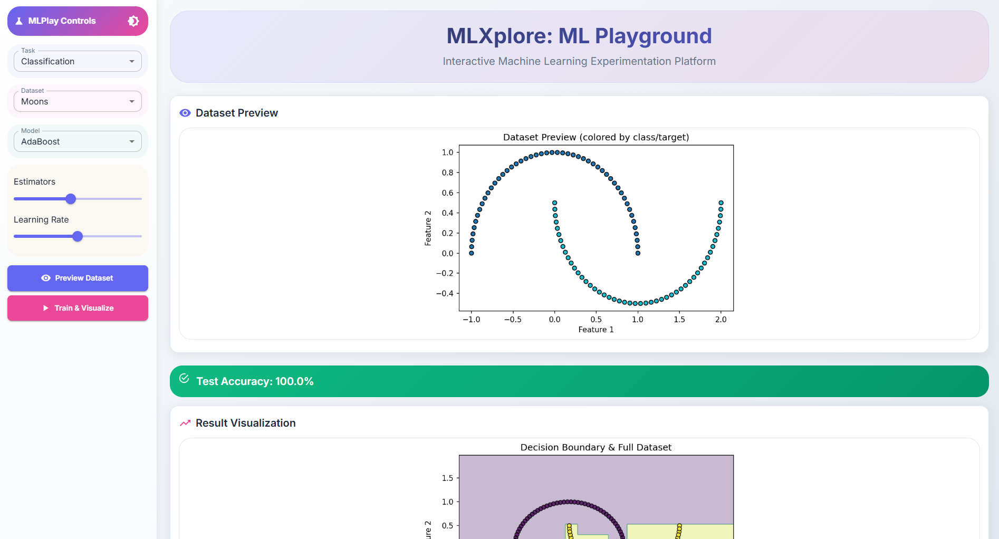
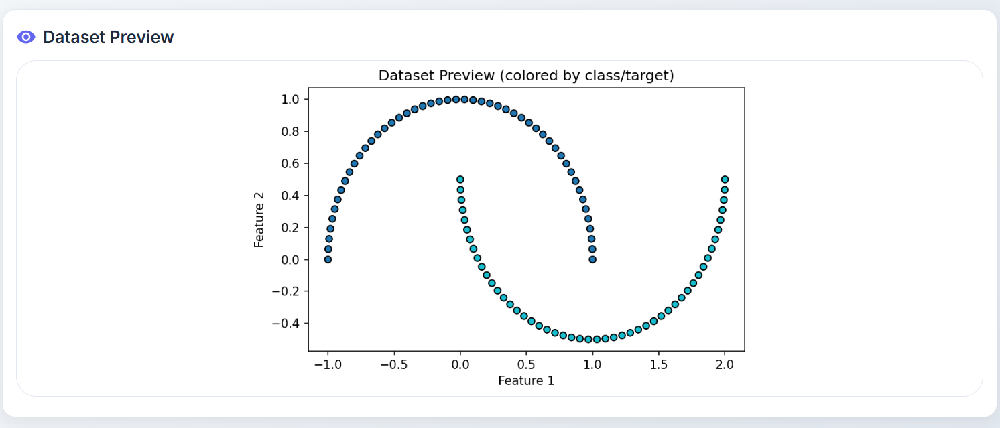
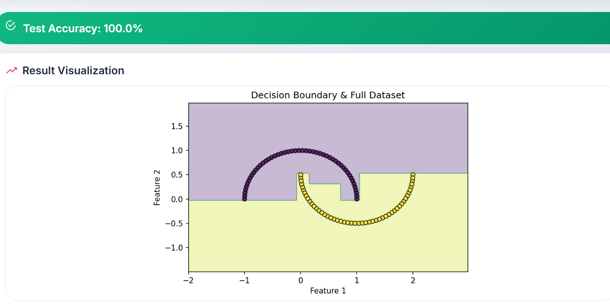

## MLXplore 

MLXplore is a full-stack Machine Learning experimentation platform designed to simplify the process of building, testing, and exploring ML models.
Main Purpose: MLXplore allows users to explore and experiment with various machine learning tasks (classification, regression, clustering), datasets, and models through a user-friendly interface. It facilitates data preview, model training, and hyperparameter tuning.

## 🚀 Key Features

- **End-to-End ML Experimentation**: Train models with custom datasets , Run experiments and visualize results , Compare different models and hyperparameters.
- **Interactive ML Tasks**: Users can select from classification, regression, and clustering tasks.
- **Dataset Exploration**: A variety of pre-defined datasets are available for each task.
- **Model Selection**: A range of popular ML algorithms are supported for each task.
- **Parameter Configuration**: Intuitive controls (sliders, menus, text fields) allow for dynamic adjustment of model hyperparameters.
- **Data Preview**: Visualize sample data to understand its structure.
- **Model Training & Visualization**: Train models, view performance metrics, and visualize results.
- **Hyperparameter Tuning**: Optimize model parameters using Grid Search or Random Search.
- **Theming**:  Supports both light and dark modes for a personalized experience.
- **Modern UI/UX**: Features a visually appealing and user-friendly interface with smooth animations, custom scrollbars, and enhanced interactive elements.


## Technology Used

- **FRONTEND** 
   - **React**: The core JavaScript library for building the user interface.
   - **Material-UI (MUI)**:  A popular React component library for building the UI elements.
   - **CSS**: For styling, including custom fonts (Inter), smooth animations, and responsive design.

- **BACKEND**
   - **FastAPI**: A modern, fast (high-performance) web framework for building the API.
   - **Python**: The primary language for the backend, leveraging ML libraries

- **Machine Learning Libraries (Backend)**: A range of standard ML libraries are implicitly used for tasks like data splitting, model fitting, evaluation, and hyperparameter tuning (such as scikit-learn for model selection and cross-validation, pandas for data manipulation, and numpy for numerical operations).

## Try web app here

🌐 https://ml-xplore-omega.vercel.app/  

## ⚙️ Installation

1. **Clone the Repository**:

   ```bash
   git clone https://github.com/DRITI2906/MLXplore.git
   cd MLXplore
   ```
2. **Setup Backend**:

   ```bash
   cd backend
   python -m venv venv
   venv\Scripts\activate     
   pip install -r requirements.txt
   python main.py
   ```

3. **Setup Frontend**:

   ```bash 
   cd ../frontend
   npm install 
   npm start
   ``` 

## 🎯 Why MLXplore?

- Makes machine learning experimentation more accessible.
- No need to write boilerplate ML code — just configure and run.
- Useful for: Students learning ML concepts. 

## Screenshots







## Developers Information

Created by Jeet Gupta . Connect with me on 

- [GitHub](https://github.com/DRITI2906)
- [LinkedIn](https://www.linkedin.com/in/driti-rathod-ab038a294/)
- [Email](mailto:dritirathod2906@gmail.com)

